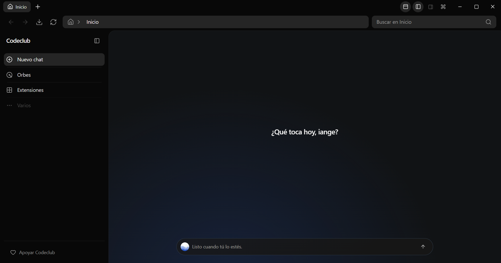

# Codeclub — AI Coding Agent for Windows

> A local-first AI coding workspace that brings your projects, AI agent, terminal, browser, and Windows desktop tools together.

Codeclub is a **local-first AI coding assistant for Windows** and a desktop **AI coding agent** workspace. Connect a compatible model provider, open a project, and ask the agent to understand your code, edit files, run commands, inspect a web page, or interact with open desktop apps.

Codeclub supports both English and Spanish, with access to project files, PowerShell, the browser, and open Windows applications.

<p align="center">
  
</p>

[](#project-status) [](#requirements) [](#how-it-works)

## Why Codeclub?

Most AI coding tools focus on a chat or an editor. Codeclub puts the agent in a **desktop development workspace** where it can use project files, PowerShell, a browser, and Windows computer-use tools from the same conversation.

- **Bring your own AI provider.** Choose a supported OpenAI-compatible provider and model; Codeclub does not lock you to one model vendor.
- **Work with your real project.** Ask the agent to read, search, and change files, run commands, inspect Git changes, and keep project chats together.
- **Use browser and desktop tools.** Work with the embedded browser, or connect the companion extension to existing Edge, Chrome, or Brave tabs for direct DOM inspection and interaction. Computer Use remains available for the rest of Windows.
- **Extend the agent.** Add plugins, skills, and MCP servers for custom tools and workflows.
- **Keep your workspace local-first.** Projects, chats, settings, and usage records are stored on your computer rather than in a Codeclub-hosted workspace.

## What you can do

- Build a feature, fix a bug, refactor code, or ask questions about a project.
- Read and edit project files, search source text, and run commands in PowerShell.
- Review Git changes and keep plans, TODOs, and artifacts with the project.
- Open a page in the built-in browser, inspect its DOM, and reference elements in chat.
- Connect the Codeclub Browser Control extension once to inspect and use open Chromium tabs without restarting the browser or enabling remote-debugging flags.
- Use Computer Use to observe and control open Windows applications, including browsers such as Edge and Chrome. Computer Use relies on Windows accessibility and OCR; some apps and controls may expose limited information.
- Create scheduled AI tasks that run while Codeclub is open.

## One workspace for agentic coding

| Workspace tool | How it helps |
| --- | --- |
| **Project chat** | Keep global or project-specific coding conversations and history. |
| **Files and Review** | Browse project files, open previews, and inspect workspace or Git changes. |
| **PowerShell terminal** | Run commands and keep interactive terminal sessions available. |
| **Browser** | Browse websites inside Codeclub, inspect page elements, and send references to chat. |
| **Browser Control extension** | Attach to tabs already open in Edge, Chrome, and Brave for DOM-aware inspection and interaction. |
| **Computer Use** | Inspect and interact with open Windows apps through UI Automation and OCR. |
| **Plans and TODOs** | Track task steps and project artifacts from the agent conversation. |
| **Plugins and MCP** | Connect skills and external tools at global or project scope. |

## Local-first, with your choice of model

Codeclub runs as a Windows desktop application and stores workspace data locally. **Local-first does not mean local AI inference:** prompts and the context needed for a response are sent to the AI provider you select. You provide that provider’s API key; Codeclub stores credentials separately in its encrypted vault. Provider usage may incur charges under that provider’s terms.

## Get started

### Requirements

- Windows.
- Node.js 24 (or a version compatible with Next.js 16) and npm 11 for development.
- An API key from a supported provider to use the AI agent.

### Run from source

```powershell
git clone https://github.com/Iangelone/Codeclub.git
cd Codeclub
npm install
npm run dev
```

To create the Windows installer:

```powershell
npm run package:win
```

The installer is generated in `release/`. See [development and releases](docs/development.md) for the full workflow.

To connect an existing Chromium browser, open **Extensions → Codeclub Browser
Control → Install**. Codeclub opens the browser's extension manager and the bundled
extension folder; enable Developer mode, choose **Load unpacked**, and confirm the
browser's permission prompt. Use **Uninstall** there to confirm removal. Edge,
Chrome, Brave, Opera, and Vivaldi are supported. See
[Computer Use on Windows](docs/computer.md) for the steps and permissions.

## How it works

Codeclub uses React and Next.js for the interface and Electron for Windows operations. The renderer does not access Node.js directly: filesystem, terminal, browser, and computer-use actions pass through Electron’s preload bridge and IPC.

The agent uses a multi-step tool loop, with LangGraph for orchestration, LangChain for tool validation and execution, and AI SDK for provider transport and streaming. MCP servers, skills, and plugins can extend the available tools.

## Project status

Codeclub is in **early beta** and currently targets Windows. Scheduled tasks run while the app remains open. Computer Use depends on what each Windows application exposes through accessibility and OCR. The project documents active integrations, limitations, and verification in the [agent stack overview](docs/agent.md).

## Documentation

- [Architecture](docs/architecture.md)
- [Agent stack, integrations, and limits](docs/agent.md)
- [Computer Use on Windows](docs/computer.md)
- [Scheduled AI tasks](docs/schedule.md)
- [Terminal and browser](docs/workspace.md)
- [Development and releases](docs/development.md)
- [All documentation](docs/README.md)

## License and support

Codeclub uses a **dual license**: free use is available for personal, educational, nonprofit, and qualifying open-source work. Companies and other commercial use require a commercial license. See [LICENSE.md](LICENSE.md) or contact [codeclubide@gmail.com](mailto:codeclubide@gmail.com).

- Ideas and bug reports: [GitHub Issues](https://github.com/Iangelone/Codeclub/issues)
- Support Codeclub: [Ko-fi](https://ko-fi.com/iangeldev)

Fluid Orb is adapted from [Rare UI](https://www.rareui.com/components/fluidorb).
